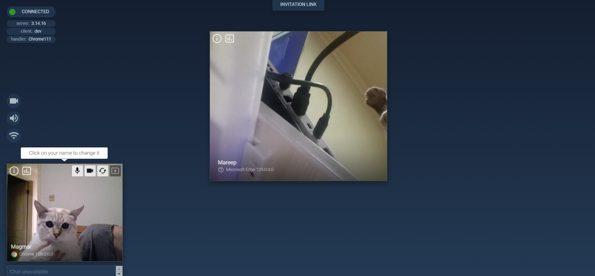

# mediasoup-sharp

Cutting Edge WebRTC Video Conferencing ported to .NET from [mediasoup](https://github.com/versatica/mediasoup/)

## Example



## Reference


+ Github : [mediasoup](https://github.com/versatica/mediasoup/)
+ Website : [mediasoup.org](https://mediasoup.org/)

## Getting Start

Try [Antelcat.MediasoupSharp.Demo](./src/Antelcat.MediasoupSharp.Demo/), which is an ASP.NET server side,
the client app is from [mediasoup-demo](./mediasoup-demo/app/)

get into mediasoup demo, and install npm packages in `app` and `server`

```shell
cd mediasoup
cd server
npm install
```

after install packages in `app`, gulp build web app

```shell
cd mediasoup
cd app
npm install
npm run start
```

remember to config your announced address in [mediasoup.config.json](./src/Antelcat.MediasoupSharp.Demo/mediasoup.config.json)

for example :

```json
{
    "protocol": "udp",
    "ip": "0.0.0.0",
    "announcedAddress": "your announced Address",
    "portRange": {
        "min": 40000,
        "max": 49999
    }
}
```

when all above are down, dotnet run `Antelcat.MediasoupSharp.Demo`
